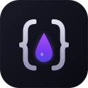

<p align="center">
  
</p>

<h1 align="center">Decant</h1>

<p align="center">
  <strong>Extract clean Markdown, JSON or MCP from any web page.</strong><br>
  Chrome Extension + MCP Server for AI agents.
</p>

<p align="center">
  <a href="https://chrome.google.com/webstore/detail/decant/iddjjbfkefeikdjcnhlklblfanhdignj"></a>
  <a href="https://chrome.google.com/webstore/detail/decant/iddjjbfkefeikdjcnhlklblfanhdignj"></a>
  <a href="https://www.npmjs.com/package/decant-mcp"></a>
  <a href="https://github.com/Swih/decant-extension/actions/workflows/ci.yml"></a>
  <a href="LICENSE"></a>
</p>

<br>

<p align="center">
  
</p>

<p align="center"><em>Extract any web page into structured MCP output — ready for Claude, ChatGPT, or any AI agent.</em></p>

---

## Why Decant?

Most web clippers give you messy HTML or lossy plain text. Decant gives you **clean, structured content** in three formats — designed for humans and AI agents alike.

- **One click, three formats** — Markdown for notes (Obsidian, Notion), JSON for developers, MCP for AI agents. No configuration needed.
- **MCP Bridge** — connect Chrome tabs directly to Claude Desktop. Ask Claude to read, summarize, or compare any open page — zero copy-pasting.
- **100% local** — all processing happens on your device. No servers, no accounts, no tracking. Open source (MIT).

> **Decant is a privacy-first alternative to MarkDownload, SingleFile, and Reader View** — with native Model Context Protocol support for the AI era.

---

## What It Looks Like

<table>
<tr>
<td width="50%">

<p align="center">
  
</p>

**Clean popup UI** — choose your format, toggle Smart Extract options, and extract in one click. The DOM Picker lets you visually select specific page elements.

</td>
<td width="50%">

<p align="center">
  
</p>

**Works on any page** — Wikipedia, documentation, blog posts, news articles. Decant uses Mozilla Readability to isolate the main content from page noise.

</td>
</tr>
</table>

<table>
<tr>
<td width="60%">

<p align="center">
  
</p>

**MCP Bridge + History** — toggle the bridge to connect Chrome to Claude Desktop. Extraction history lets you revisit recent pages. Built-in feedback keeps the project improving.

</td>
<td width="40%">

<p align="center">
  
</p>

**Dark mode** — full light/dark theme support. Your eyes will thank you.

</td>
</tr>
</table>

---

## Install

<a href="https://chrome.google.com/webstore/detail/decant/iddjjbfkefeikdjcnhlklblfanhdignj">
  
</a>

Or load unpacked for development — see [Development](#development) below.

---

## MCP Bridge — Connect Chrome to Claude Desktop

Decant bridges your browser tabs to Claude Desktop through the [Model Context Protocol](https://modelcontextprotocol.io). Ask Claude to read, summarize, compare, or analyze any web page — directly from the conversation.

### Setup (3 steps)

**1. Install the MCP server globally:**

```bash
npm install -g decant-mcp
```

**2. Add to your Claude Desktop config** (`claude_desktop_config.json`):

```json
{
  "mcpServers": {
    "decant": {
      "command": "decant-mcp"
    }
  }
}
```

**3. Enable MCP Bridge** in the Decant popup toggle. Done — Claude can now access your browser.

### MCP Tools

| Tool | Description |
|------|-------------|
| `list_tabs` | List all open Chrome tabs (title, URL, ID) |
| `extract_active_tab` | Extract the currently focused tab |
| `extract_tab` | Extract a specific tab by ID |
| `extract_url` | Open a URL in background, extract it, close the tab |

### Architecture

```
Claude Desktop  ←— stdio —→  decant-mcp (Node.js)  ←— WebSocket —→  Chrome Extension
                              localhost:22816
```

All communication stays on `localhost`. No cloud relay, no external servers.

---

## Features

| Feature | Description |
|---------|-------------|
| **3 output formats** | Markdown, JSON, and MCP — paste into Obsidian, Notion, ChatGPT, Claude, or feed to AI pipelines |
| **Smart Extract** | Mozilla Readability isolates article content from ads, navbars, and footers |
| **Table detection** | HTML tables detected and converted to clean Markdown or structured JSON |
| **Entity extraction** | Dates, emails, and prices automatically identified in metadata |
| **DOM Picker** | Visually click any element on the page to extract just that section (`Ctrl+Shift+P`) |
| **Batch extraction** | Extract all open tabs at once into a single Markdown or JSON file |
| **Side Panel** | Chrome side panel with live formatted preview, word count, and token estimate |
| **MCP Bridge** | 4 MCP tools connecting Chrome to Claude Desktop via localhost WebSocket |
| **16 languages** | EN, FR, DE, ES, IT, PT-BR, JA, KO, ZH-CN, ZH-TW, AR, HI, ID, RU, TR, VI — RTL support for Arabic |
| **Dark mode** | Full light/dark theme with system detection |
| **Keyboard shortcuts** | 4 configurable shortcuts for power users |
| **100% privacy** | No servers, no accounts, no tracking, no analytics. All processing is local. |

---

## Output Formats

### Markdown

```markdown
# Article Title

Clean, readable content with preserved headings,
**bold**, *italic*, [links](https://...), and code blocks.

| Column A | Column B |
|----------|----------|
| Data     | Data     |
```

### JSON

```json
{
  "title": "Article Title",
  "url": "https://example.com/article",
  "content": "Clean text content...",
  "metadata": {
    "wordCount": 1234,
    "imageCount": 5,
    "tables": [],
    "entities": { "dates": [], "emails": [] }
  }
}
```

### MCP Format

Native Model Context Protocol resource output — structured metadata + content optimized for LLM context windows. Used automatically when Claude Desktop calls Decant via the MCP bridge.

---

## Keyboard Shortcuts

| Shortcut | Action |
|----------|--------|
| `Ctrl+Shift+E` (`Cmd+Shift+E` on Mac) | Extract page content |
| `Ctrl+Shift+C` (`Cmd+Shift+C` on Mac) | Extract and copy to clipboard |
| `Ctrl+Shift+S` (`Cmd+Shift+S` on Mac) | Extract and save to file |
| `Ctrl+Shift+P` (`Cmd+Shift+P` on Mac) | Activate DOM Picker |

Customize at `chrome://extensions/shortcuts`.

---

## Architecture

```
pageforge/
  src/
    background/service-worker.js   # MV3 orchestrator + MCP bridge client
    content/extractor.js           # DOM extraction (injected on-demand)
    content/dom-picker.js          # Visual element selector
    core/parser.js                 # Extraction pipeline (Readability + Turndown)
    offscreen/offscreen.js         # DOM parsing in offscreen document
    popup/popup.js                 # Popup UI + MCP toggle
    sidepanel/panel.js             # Side panel UI
    utils/storage.js               # chrome.storage wrapper
    components/                    # Web Components (Shadow DOM)
  _locales/                        # 16 languages

mcp-server/                        # npm: decant-mcp
  bin/decant-mcp.js                # CLI entry point
  src/
    index.js                       # MCP Server + stdio transport
    bridge/ws-server.js            # WebSocket server (port 22816)
    tools/                         # list-tabs, extract-active-tab, extract-tab, extract-url
```

**How extraction works:**
1. User triggers extraction (popup, shortcut, context menu, or MCP request)
2. Content script extracts raw DOM from the target tab
3. Offscreen document parses HTML via Mozilla Readability
4. Parser converts to Markdown (Turndown), JSON, or MCP format
5. Result displayed in popup/side panel, copied to clipboard, or returned to the MCP server

---

## Development

```bash
# Install dependencies
npm install

# Development (with HMR)
npm run dev

# Build for production
npm run build

# Run tests (66 tests, Vitest)
npm test

# Lint & format
npm run lint
npm run format
```

### Load in Chrome

1. `npm run build`
2. Open `chrome://extensions/`
3. Enable "Developer mode"
4. Click "Load unpacked" and select the `dist/` folder

---

## Privacy

- **100% local** — all extraction happens in your browser, nothing sent to any server
- **MCP Bridge** — communicates over `localhost:22816` only, never leaves your machine
- **Optional permissions** — `tabs` and `<all_urls>` requested only when MCP Bridge is enabled
- **No accounts, no tracking, no analytics** — zero telemetry
- [Full privacy policy](https://decant-extension.vercel.app/privacy)

---

## Contributing

See [CONTRIBUTING.md](CONTRIBUTING.md) for development setup, testing, and PR guidelines.

---

## License

[MIT](LICENSE) — Zoplop Studio
